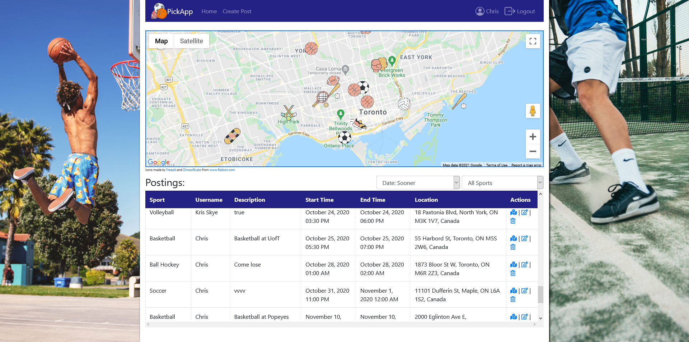
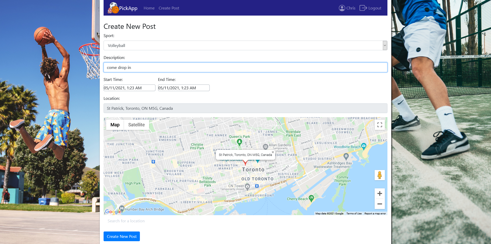

# PickApp <!-- omit in toc -->

**_Table of Contents:_**

- [Preview](#preview)
- [About](#about)
- [Tech Stack](#tech-stack)

# Preview

This project is currently live at https://www.pickapp.fit or at https://pick-app-sports.herokuapp.com.

# About

PickApp is a platform for athletes to connect with one another through pick up sports.

Users can create a posting, indicating what sport they are placing, where, and for how long.

The postings will be listed on the home page, in a table format and as markers ontop of a google map.

Users can edit their postings from either the home page or on their profile page.

The profile page can be accessed by clicking on the user's username at the top right on the navigation bar or by going to the /profile page.

Users can register by email or with google or with facebook.

# Tech Stack

MERN (MongoDB, Express, React, Node)

| Other Highlights |
| :--------------: |
|       JTW        |
|   Google Maps    |
|    Bootstrap     |
